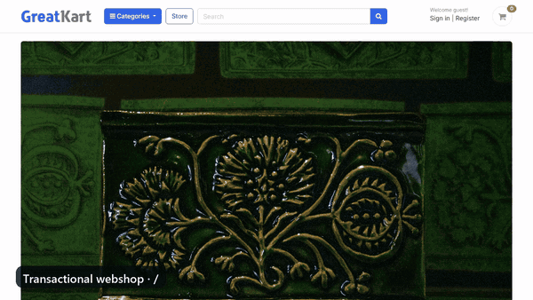

# Client-Directed Django Webshop

A deployed Django e-commerce project delivered in two forms for a jewellery client: a transactional storefront and a luxury, salesperson-assisted buying experience.

[](docs/django-webshop-demo.mp4)

_Transactional webshop → client-directed assisted sales._

[Open the transactional webshop](https://ermis.pythonanywhere.com/) · [Open the luxury version](https://ermis.pythonanywhere.com/lux/) · [View the luxury implementation branch](../../tree/feature/modernize-ui)

## What It Demonstrates

- Custom Django accounts, profiles, authentication, and order history
- Categorized products with colour/size variations, stock, galleries, ratings, and reviews
- Cart, checkout, order creation, confirmation, and customer email workflows
- Django Admin catalogue and order management
- Tested PayPal Sandbox capture flow for the transactional demo
- Enquiry-based checkout with customer confirmation and salesperson notification
- Environment-driven branding, email, and storefront mode configuration
- Public deployment on PythonAnywhere

## Client Requirement Shift

The first version implements direct online checkout. When the client's sales strategy changed toward consultation-led luxury sales, the project retained that transactional workflow and added a separate `/lux/` experience that routes product interest to a salesperson instead.

Keeping both versions makes the product decision visible: the same catalogue can support either self-service purchasing or a higher-touch enquiry workflow without discarding the original implementation.

## Architecture

```text
Browser
  ├─ accounts / catalogue / reviews
  ├─ cart / checkout / PayPal Sandbox
  └─ luxury product enquiry
             │
             ▼
          Django
  ├─ accounts
  ├─ store + category
  ├─ cart + orders
  ├─ sales_inquiries
  └─ admin-managed catalogue
             │
             ▼
           SQLite
```

Important implementation areas:

- `accounts/` — custom users, profiles, authentication, and order history
- `store/` and `category/` — catalogue, variants, galleries, reviews, and filtering
- `cart/` and `orders/` — cart-to-order lifecycle and payment records
- `sales_inquiries/` — enquiry creation, validation, and email handoff
- `templates/payments/_paypal_button.html` — PayPal Sandbox browser capture
- `webshop/settings.py` — environment-specific security, email, branding, and sales-mode settings

## Run Locally

```bash
python -m venv .venv
# Windows: .venv\Scripts\activate
# macOS/Linux: source .venv/bin/activate
python -m pip install -r requirements.txt
cp .env.example .env
python manage.py migrate
python manage.py createsuperuser
python manage.py runserver
```

Run the Django checks and tests with:

```bash
python manage.py check
python manage.py test
```

## Evidence Boundaries

The original GreatKart foundation is course-derived; the client-directed storefront changes, assisted-sales workflow, deployment, and requirement adaptation are the relevant ownership story.

PayPal Sandbox checkout was tested end to end. The backend stores the browser capture result but does not independently verify the transaction with PayPal, so this repository does **not** claim hardened production payment processing, real-money transactions, users, revenue, or adoption.
